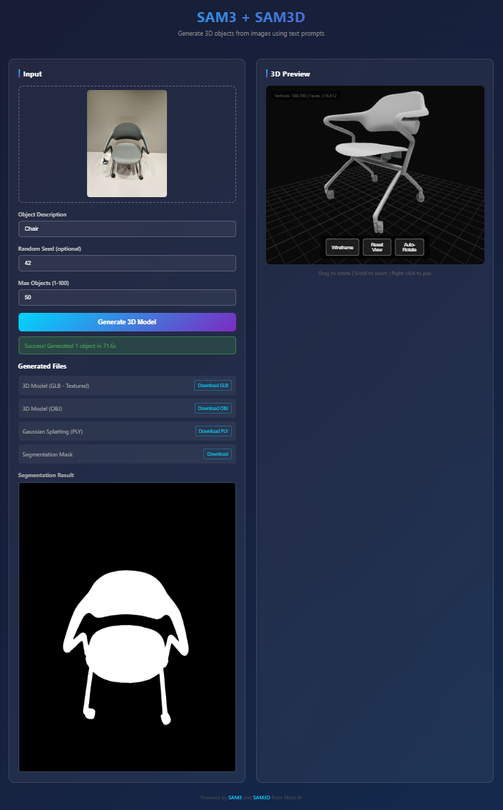

# SAM3-SAM3D-Pipeline

> **A personal project combining Meta's SAM3 and SAM3D for text-to-3D object extraction**

[](https://opensource.org/licenses/MIT)

**Generate 3D objects from images using text prompts.**

This is a **personal integration project** that combines two excellent Meta AI research projects:
- [**SAM3**](https://github.com/facebookresearch/sam3) (Segment Anything Model 3) for text-based segmentation
- [**SAM3D**](https://github.com/facebookresearch/sam-3d-objects) for single-image 3D reconstruction

The pipeline provides a unified interface to go from a 2D image + text prompt → segmented objects → 3D meshes.

> ⚠️ **Disclaimer**: This is an independent integration project and is **not affiliated with, endorsed by, or officially connected to Meta AI**. SAM3 and SAM3D are research projects by Meta AI, licensed under the SAM License. Please refer to the original repositories for official implementations.



## Features

- **Text-to-3D**: Describe what you want to extract ("horse", "car", "person") and get a 3D model
- **Multi-object support**: Automatically detects and reconstructs ALL matching objects in an image
- **Multiple output formats**: GLB, OBJ, PLY (Gaussian splats)
- **Web interface**: Easy-to-use browser-based UI with 3D preview
- **Flexible deployment**: Docker, Apptainer/Singularity, or SLURM HPC clusters

## Quick Start

### Prerequisites

- **NVIDIA GPU**: 32GB+ VRAM recommended (A100, H100, H200, RTX 4090)
- **NVIDIA Driver**: 560+ with CUDA 12.x support
- **Container Runtime**: Docker or Apptainer/Singularity
- **HuggingFace account**: Access to [facebook/sam3](https://huggingface.co/facebook/sam3) (gated model)

### Installation

1. **Clone this repository:**
   ```bash
   git clone https://github.com/benoitmarteau/sam3-sam3d-pipeline.git
   cd sam3-sam3d-pipeline
   ```

2. **Clone Meta's repositories:**
   ```bash
   # SAM3 - Segment Anything Model 3
   git clone https://github.com/facebookresearch/sam3.git

   # SAM3D - 3D Object Reconstruction
   git clone https://github.com/facebookresearch/sam-3d-objects.git
   ```

3. **Download SAM3D checkpoints:**
   ```bash
   # Follow instructions from SAM3D repository
   # Checkpoints should be placed in: sam-3d-objects/checkpoints/hf/
   ```

4. **Set up HuggingFace authentication:**
   ```bash
   # Request access to facebook/sam3 at https://huggingface.co/facebook/sam3
   # Then login:
   huggingface-cli login
   ```

5. **Build the container (choose one):**

   **Option A: Docker**
   ```bash
   ./scripts/build_docker.sh
   ```

   **Option B: Apptainer/Singularity**
   ```bash
   ./scripts/build_apptainer.sh
   ```

   **Option C: SLURM HPC Cluster**
   ```bash
   sbatch docker/build_apptainer.sbatch
   ```

   > **Note**: Building takes 30-60 minutes and requires ~128GB RAM

6. **Start the webapp (choose one):**

   **Option A: Docker**
   ```bash
   ./scripts/run_webapp_docker.sh
   ```

   **Option B: Apptainer/Singularity**
   ```bash
   ./scripts/run_webapp_apptainer.sh
   ```

   **Option C: SLURM HPC Cluster**
   ```bash
   sbatch docker/run_webapp_apptainer.sbatch
   ```

7. **Access the webapp:**
   ```bash
   # Local/Docker: Open directly
   open http://localhost:8000

   # HPC Cluster: Create SSH tunnel first
   ssh -L 8000:<NODE_HOSTNAME>:8000 user@cluster-login-node
   open http://localhost:8000
   ```

## Deployment Options

### Docker (Recommended for local/cloud)

Best for: Local workstations, cloud instances, Kubernetes

```bash
# Build image
./scripts/build_docker.sh

# Run webapp
./scripts/run_webapp_docker.sh

# Or run manually with custom options
docker run --gpus all -p 8000:8000 \
  -v $(pwd)/sam3:/app/sam3:ro \
  -v $(pwd)/sam-3d-objects:/app/sam-3d-objects:ro \
  -v $(pwd)/webapp:/app/webapp:ro \
  -v $(pwd)/pipeline.py:/app/pipeline.py:ro \
  -v $(pwd)/lib:/app/lib:ro \
  -v $(pwd)/webapp_outputs:/app/webapp_outputs \
  -v ~/.cache/huggingface:/root/.cache/huggingface \
  sam3d:latest
```

### Apptainer/Singularity (Recommended for HPC)

Best for: Shared HPC clusters, environments without root access

```bash
# Build image
./scripts/build_apptainer.sh

# Run webapp
./scripts/run_webapp_apptainer.sh

# Or run manually
apptainer exec --nv \
  --bind sam3:/app/sam3:ro \
  --bind sam-3d-objects:/app/sam-3d-objects:ro \
  --bind webapp:/app/webapp:ro \
  --bind pipeline.py:/app/pipeline.py:ro \
  --bind lib:/app/lib:ro \
  --bind webapp_outputs:/app/webapp_outputs \
  --bind ~/.cache/huggingface:/root/.cache/huggingface \
  sam3d.sif python -u /app/webapp/app.py
```

### SLURM HPC Cluster

Best for: Scheduled batch processing on HPC clusters

```bash
# Edit the sbatch files to customize for your cluster:
# - Set --partition and --qos to match your cluster's configuration
# - Set LOGIN_NODE to your cluster's login node hostname
# - Adjust GPU type with --gres=gpu:YOUR_GPU_TYPE:1

# Build container (submit as job)
sbatch docker/build_apptainer.sbatch

# Run webapp (submit as job)
sbatch docker/run_webapp_apptainer.sbatch

# Check the logs for SSH tunnel instructions
cat logs/webapp_url_<JOB_ID>.txt
```

## Project Structure

```
sam3-sam3d-pipeline/
├── docker/                    # Container configuration
│   ├── Dockerfile            # Docker build file
│   ├── sam3d.def             # Apptainer/Singularity definition file
│   ├── build_apptainer.sbatch # SLURM job to build container
│   └── run_webapp_apptainer.sbatch # SLURM job to run webapp
├── scripts/                   # Shell scripts for local execution
│   ├── build_docker.sh       # Build Docker image
│   ├── run_webapp_docker.sh  # Run webapp with Docker
│   ├── build_apptainer.sh    # Build Apptainer image
│   └── run_webapp_apptainer.sh # Run webapp with Apptainer
├── lib/                       # Compatibility utilities
│   ├── __init__.py
│   └── utils3d_compat.py     # API compatibility patches for utils3d
├── webapp/                    # FastAPI web application
│   ├── app.py                # Backend server
│   └── static/index.html     # Frontend with Three.js 3D viewer
├── docs/                      # Documentation
│   └── TECHNICAL.md          # Technical overview
├── sam3/                      # [Clone from Meta] SAM3 repository
├── sam-3d-objects/            # [Clone from Meta] SAM3D repository
│   └── checkpoints/hf/        # Model checkpoints (download separately)
├── pipeline.py                # Combined SAM3 + SAM3D pipeline
├── sam3d.sif                  # Built Apptainer container (~11GB)
└── README.md                  # This file
```

## Usage

### Web Interface

1. Upload an image
2. Enter a text prompt describing the object(s) to extract
3. Click "Generate 3D Model"
4. View and download the results

### Python API

```python
from pipeline import SAM3SAM3DPipeline

# Initialize pipeline
pipeline = SAM3SAM3DPipeline(
    sam3d_config_path="sam-3d-objects/checkpoints/hf/pipeline.yaml",
    lazy_load=True
)

# Generate 3D from image + prompt
result = pipeline.run_multi_object(
    image_path="path/to/image.jpg",
    prompt="horse",
    output_dir="output/",
    seed=42,
    max_objects=10
)

# Results include:
# - result["glb_path"]: Textured mesh (GLB format)
# - result["ply_path"]: Gaussian splats (PLY format)
# - result["objects"]: List of individual object outputs
```

### REST API

```bash
# Generate 3D model
curl -X POST "http://localhost:8000/api/generate_3d" \
  -F "image=@photo.jpg" \
  -F "text_prompt=horse" \
  -F "seed=42" \
  -F "max_objects=10"

# Response:
# {
#   "success": true,
#   "job_id": "abc123",
#   "glb_url": "/objects/abc123/scene.glb",
#   "ply_url": "/objects/abc123/scene.ply",
#   "num_objects": 2
# }
```

## Configuration

### Environment Variables

| Variable | Default | Description |
|----------|---------|-------------|
| `PORT` | 8000 | Web server port |
| `HF_CACHE` | `~/.cache/huggingface` | HuggingFace model cache |
| `TORCH_CACHE` | `~/.cache/torch` | PyTorch model cache |
| `TORCH_CUDA_ARCH_LIST` | `8.0;8.6;8.9;9.0` | GPU architectures for JIT compilation |
| `CUDA_VISIBLE_DEVICES` | `0` | GPU device to use |

### SLURM Configuration

Edit the sbatch files to customize for your cluster:

```bash
# docker/run_webapp_apptainer.sbatch

# GPU type (A100, H100, V100, etc.)
#SBATCH --gres=gpu:1

# Partition/queue
#SBATCH --partition=gpu

# QOS (quality of service)
#SBATCH --qos=normal

# Memory
#SBATCH --mem=64G

# Time limit
#SBATCH -t 08:00:00
```

Set your cluster's login node for SSH tunnel instructions:
```bash
LOGIN_NODE="login.mycluster.edu"
```

## Known Limitations

1. **Multi-object spatial relationships**: SAM3D reconstructs objects independently. The relative positions of objects in a multi-object scene are approximate, not exact representations of the original scene layout. (See [SAM3D Issue #53](https://github.com/facebookresearch/sam-3d-objects/issues/53))

2. **Texture baking**: Currently uses vertex colors instead of UV-mapped textures due to nvdiffrast JIT compilation constraints in the container environment.

3. **Memory requirements**: Processing large images or many objects requires significant GPU memory (32GB+ recommended).

## Troubleshooting

### HuggingFace Authentication Error (401)
```
Request access to the gated model at:
https://huggingface.co/facebook/sam3

Then run: huggingface-cli login
```

### Container Build Fails
```bash
# Ensure sufficient resources
FORCE_BUILD=true ./scripts/build_docker.sh

# Check build logs
tail -f logs/docker_build.log
```

### GPU Memory Issues
- Reduce `max_objects` parameter
- Use a GPU with more VRAM (A100 80GB or H100 recommended)

### Docker GPU Not Found
```bash
# Install nvidia-container-toolkit
# See: https://docs.nvidia.com/datacenter/cloud-native/container-toolkit/install-guide.html

# Verify GPU access
docker run --gpus all nvidia/cuda:12.0-base nvidia-smi
```

## Technical Details

See [docs/TECHNICAL.md](docs/TECHNICAL.md) for:
- Architecture overview
- API compatibility layer (utils3d changes)
- Container configuration details
- PyTorch version requirements

## Acknowledgments

This project is built entirely upon the excellent research from Meta AI. All credit for the underlying models and algorithms goes to the original authors.

### SAM3 (Segment Anything Model 3)
- **Repository**: [github.com/facebookresearch/sam3](https://github.com/facebookresearch/sam3)
- **Paper**: [SAM 3: Segment Anything with Concepts](https://arxiv.org/abs/2511.16719)
- **License**: SAM License

### SAM3D (SAM 3D Objects)
- **Repository**: [github.com/facebookresearch/sam-3d-objects](https://github.com/facebookresearch/sam-3d-objects)
- **Paper**: [SAM 3D: 3Dfy Anything in Images](https://arxiv.org/abs/2511.16624)
- **License**: SAM License

## License

This integration code is released under the [MIT License](LICENSE).

**Important**: The underlying SAM3 and SAM3D models are licensed under the [SAM License](https://github.com/facebookresearch/sam3/blob/main/LICENSE) by Meta AI. Please review and comply with their license terms when using this pipeline.

## Citation

If you use this pipeline in your research, please cite the original papers:

```bibtex
@misc{carion2025sam3segmentconcepts,
  title={SAM 3: Segment Anything with Concepts},
  author={Nicolas Carion and Laura Gustafson and Yuan-Ting Hu and Shoubhik Debnath and Ronghang Hu and Didac Suris and Chaitanya Ryali and Kalyan Vasudev Alwala and Haitham Khedr and Andrew Huang and Jie Lei and Tengyu Ma and Baishan Guo and Arpit Kalla and Markus Marks and Joseph Greer and Meng Wang and Peize Sun and Roman Rädle and Triantafyllos Afouras and Effrosyni Mavroudi and Katherine Xu and Tsung-Han Wu and Yu Zhou and Liliane Momeni and Rishi Hazra and Shuangrui Ding and Sagar Vaze and Francois Porcher and Feng Li and Siyuan Li and Aishwarya Kamath and Ho Kei Cheng and Piotr Dollár and Nikhila Ravi and Kate Saenko and Pengchuan Zhang and Christoph Feichtenhofer},
  year={2025},
  eprint={2511.16719},
  archivePrefix={arXiv},
  primaryClass={cs.CV},
  url={https://arxiv.org/abs/2511.16719}
}

@article{sam3dteam2025sam3d3dfyimages,
  title={SAM 3D: 3Dfy Anything in Images},
  author={SAM 3D Team and Xingyu Chen and Fu-Jen Chu and Pierre Gleize and Kevin J Liang and Alexander Sax and Hao Tang and Weiyao Wang and Michelle Guo and Thibaut Hardin and Xiang Li and Aohan Lin and Jiawei Liu and Ziqi Ma and Anushka Sagar and Bowen Song and Xiaodong Wang and Jianing Yang and Bowen Zhang and Piotr Dollár and Georgia Gkioxari and Matt Feiszli and Jitendra Malik},
  year={2025},
  eprint={2511.16624},
  archivePrefix={arXiv},
  primaryClass={cs.CV},
  url={https://arxiv.org/abs/2511.16624}
}
```

## Contributing

Contributions are welcome! Please feel free to submit a Pull Request.
